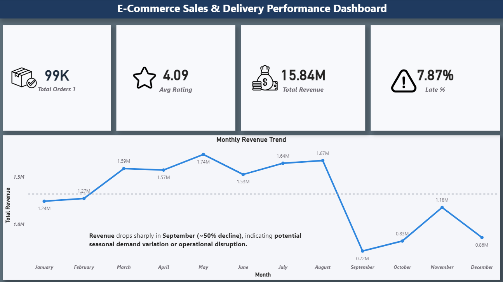
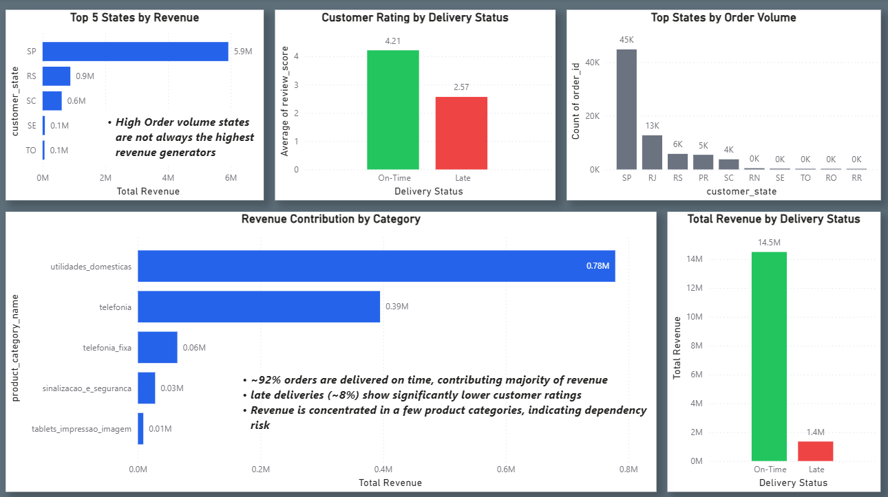
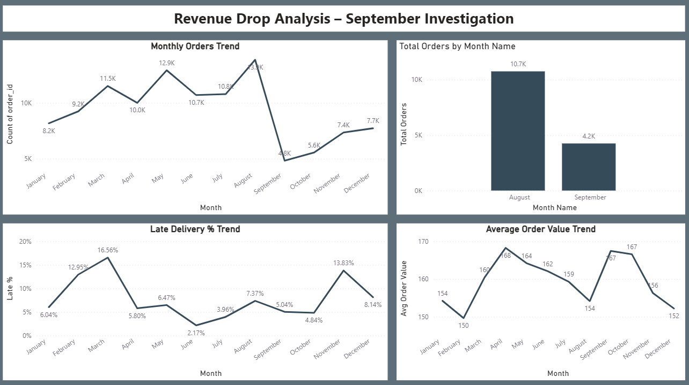

# E-commerce Sales & Delivery Performance Analysis

## Quick Navigation

📊 [Dashboard Screenshots](#dashboard-screenshots)

🗃️ [SQL Analysis](#sql-analysis)

💡 [Key Insights](#key-insights)

📈 [Business Impact](#business-impact)

🏁 [Conclusion](#conclusion)

## Project Overview

This project analyzes e-commerce sales performance, delivery efficiency, and customer satisfaction to identify business trends and opportunities for improvement.

## Business Problem

E-commerce companies need to understand:

* Which products generate the highest sales
* Which regions perform best
* Delivery performance across orders
* Customer satisfaction trends

This project uses SQL and Power BI to answer these business questions.

## Tools Used

* SQL
* Power BI
* Excel

## Dataset

The dataset contains information related to:

* Orders
* Customers
* Products
* Delivery Status
* Customer Ratings

## Project Workflow

1. Data Cleaning
2. Exploratory Data Analysis
3. KPI Calculation
4. SQL Queries
5. Dashboard Creation
6. Business Insights

## Dashboard Screenshots

### Dashboard Overview

Executive Dashboard

Late Delivery Analysis

Revenue & State Analysis

September Revenue Drop Analysis

September Root Cause Analysis

## SQL Analysis

The project uses SQL for:

* Data Cleaning and Validation
* KPI Calculations
* Revenue Trend Analysis
* Delivery Performance Analysis
* Customer Rating Analysis
* Root Cause Investigation for Revenue Decline

The complete SQL script is available in the `sql` folder.

## Key Insights

* Identified the highest revenue-generating product categories.
* Analyzed regional sales performance to determine top-performing markets.
* Evaluated delivery delays and order fulfillment efficiency.
* Examined customer satisfaction ratings and service quality trends.
* Highlighted business opportunities through KPI-driven analysis.

## Business Impact

This analysis helps e-commerce businesses:

* Identify revenue-driving product categories
* Improve delivery performance
* Reduce late-order rates
* Improve customer satisfaction
* Detect seasonal revenue fluctuations
* Support data-driven operational decisions

## Skills Demonstrated

* Data Cleaning
* SQL Query Writing
* KPI Analysis
* Data Visualization
* Dashboard Development
* Business Storytelling

## Conclusion

This project demonstrates how SQL and Power BI can be used together to transform raw e-commerce data into actionable business insights. Through sales analysis, delivery performance monitoring, customer satisfaction evaluation, and revenue trend investigation, the project highlights opportunities for operational improvement and data-driven decision-making.

