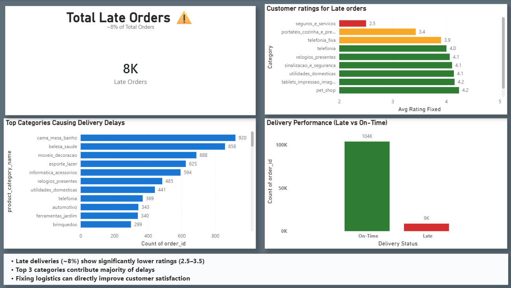
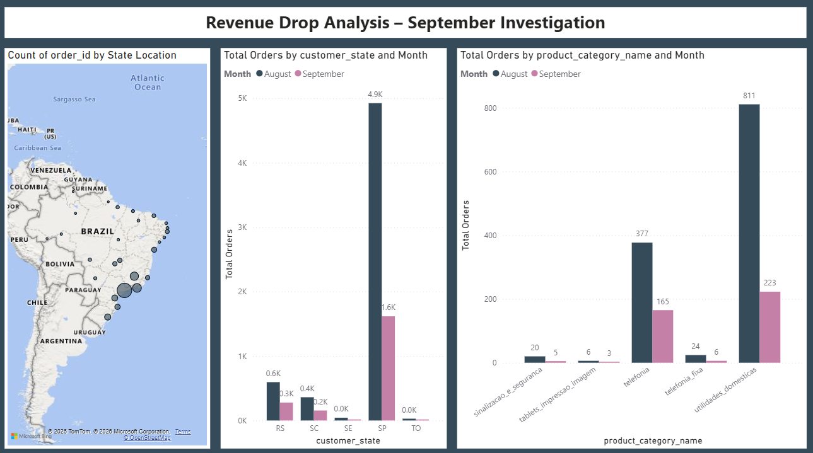

# E-commerce Sales & Delivery Performance Analysis

## Project Overview

This project analyzes e-commerce sales performance, delivery efficiency, and customer satisfaction to identify business trends and opportunities for improvement.

## Business Problem

E-commerce companies need to understand:

* Which products generate the highest sales
* Which regions perform best
* Delivery performance across orders
* Customer satisfaction trends

This project uses SQL and Power BI to answer these business questions.

## Tools Used

* SQL
* Power BI
* Excel

## Dataset

The dataset contains information related to:

* Orders
* Customers
* Products
* Delivery Status
* Customer Ratings

## Project Workflow

1. Data Cleaning
2. Exploratory Data Analysis
3. KPI Calculation
4. SQL Queries
5. Dashboard Creation
6. Business Insights

## Dashboard Screenshots

### Dashboard Overview

## Key Insights

(To be added after dashboard completion)

## Skills Demonstrated

* Data Cleaning
* SQL Query Writing
* KPI Analysis
* Data Visualization
* Dashboard Development
* Business Storytelling
